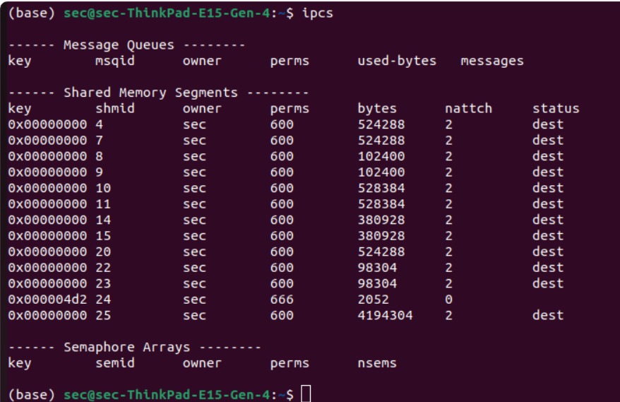

# Linux-IPC-Shared-memory
Ex06-Linux IPC-Shared-memory

# AIM:
To Write a C program that illustrates two processes communicating using shared memory.

# DESIGN STEPS:

### Step 1:

Navigate to any Linux environment installed on the system or installed inside a virtual environment like virtual box/vmware or online linux JSLinux (https://bellard.org/jslinux/vm.html?url=alpine-x86.cfg&mem=192) or docker.

### Step 2:

Write the C Program using Linux Process API - Shared Memory

### Step 3:

Execute the C Program for the desired output. 

# PROGRAM:
## Write a C program that illustrates two processes communicating using shared memory.

```c
#include <stdio.h>
#include <sys/ipc.h>
#include <sys/shm.h>

int main()
{
	key_t key = ftok("shmfile", 65);
	int shmid = shmget(key, 1024, 0666 | IPC_CREAT);
      printf("Shared memory id = %d \n",shmid);

	char* str = (char*)shmat(shmid, (void*)0, 0);
	
    printf("Write Data : ");
	fgets(str, 1024, stdin);

	printf("Data written in memory: %s\n", str);

	shmdt(str);

	return 0;
}
```
## OUTPUT


# RESULT:
The program is executed successfully.
